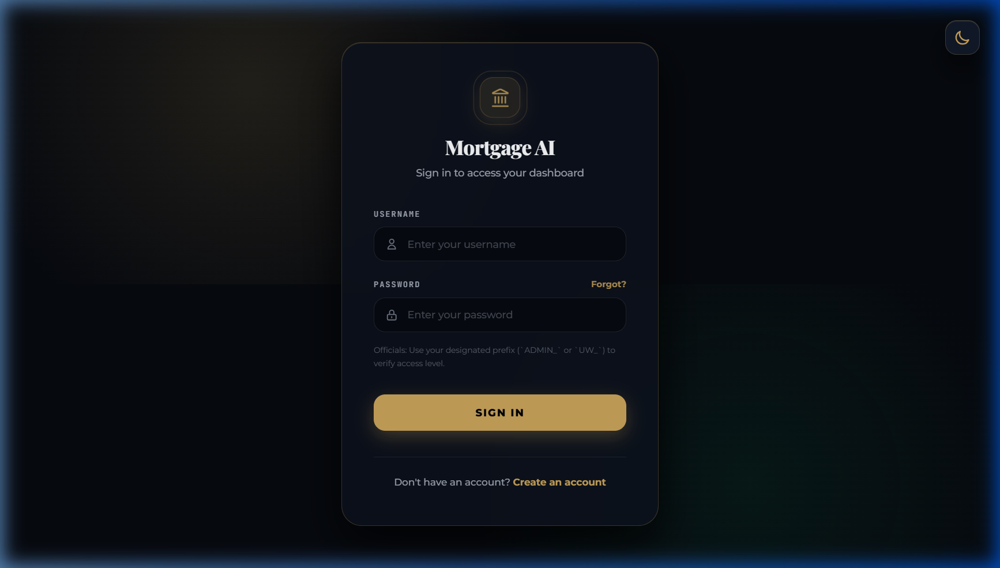
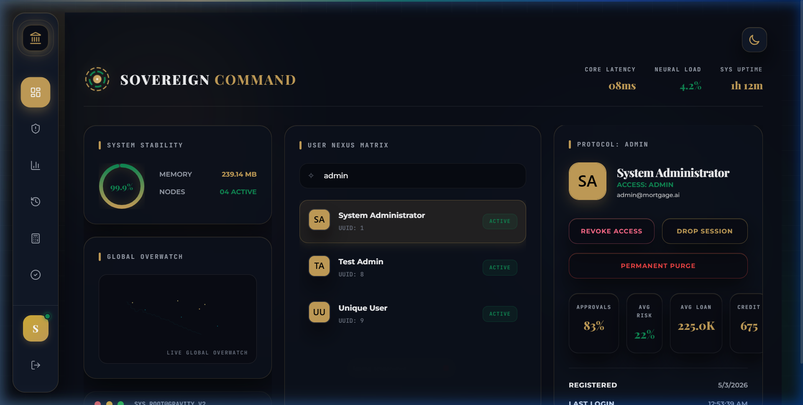
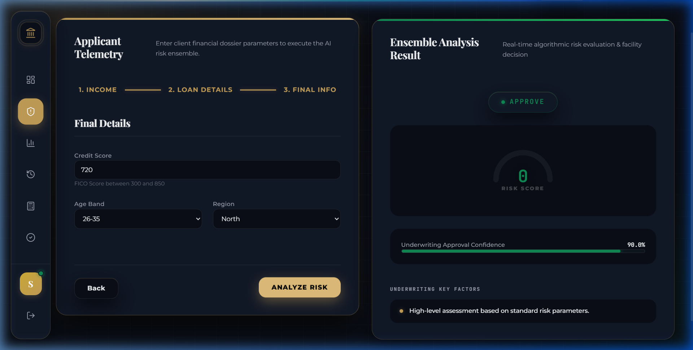
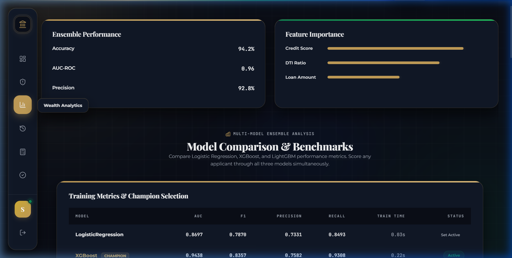
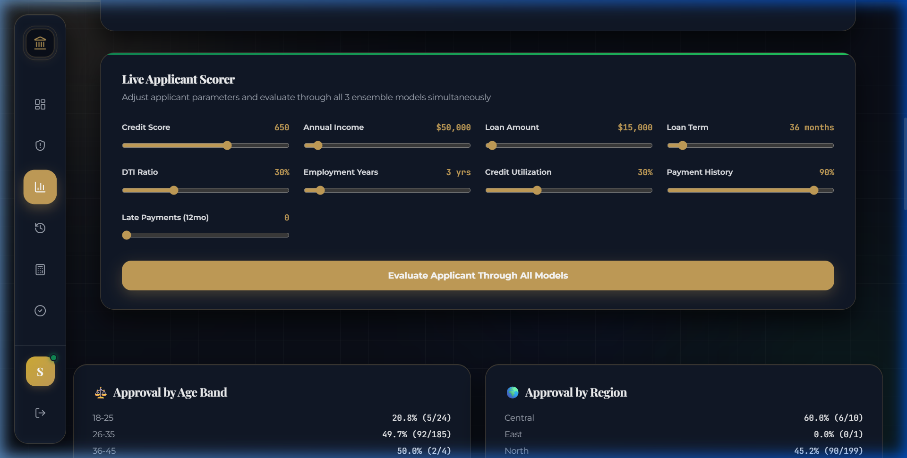
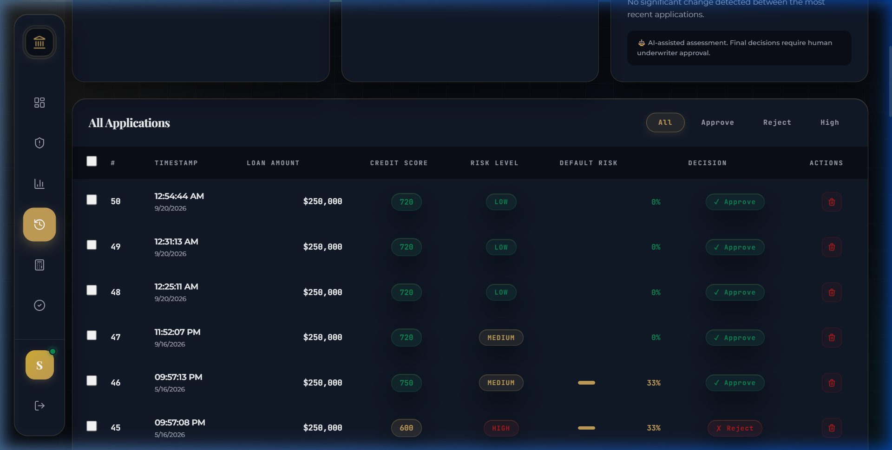
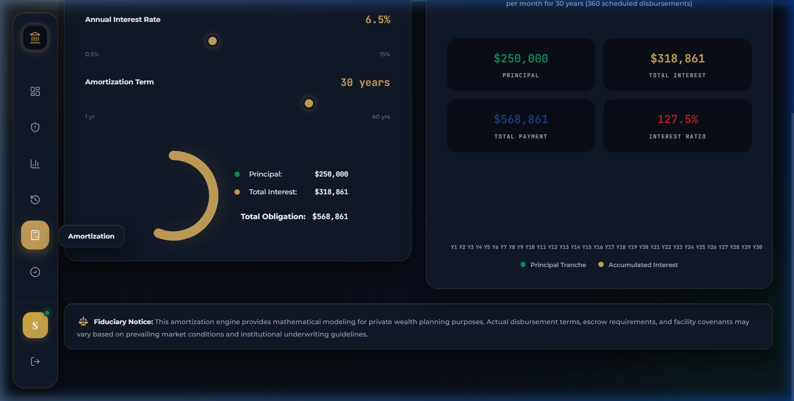
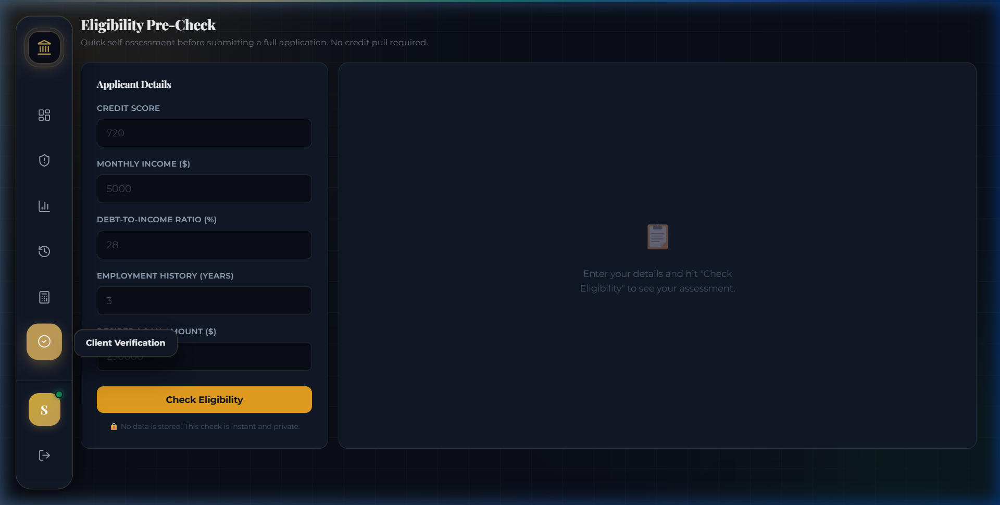

<div align="center">

# 🏦 AI Mortgage Decision System

**AI-powered mortgage underwriting assistant combining ML ensemble inference, Monte Carlo risk simulation, SHAP explainability, and fairness auditing.**

[](https://react.dev)
[](https://vitejs.dev)
[](https://fastapi.tiangolo.com)
[](https://python.org)
[](https://xgboost.readthedocs.io)
[](https://lightgbm.readthedocs.io)
[](LICENSE)

[**🚀 Live Demo**](https://ai-mortgage-decision-system-pied.vercel.app) · [**📁 Repository**](https://github.com/Gaurav-Ojha65/AI_Mortgage_Decision_System)

</div>

---

## 🚦 Deployment Status

| Layer | Status | URL |
|---|---|---|
| **Frontend** | ✅ Live on Vercel | [ai-mortgage-decision-system-pied.vercel.app](https://ai-mortgage-decision-system-pied.vercel.app) |
| **Backend** | ✅ Live on Render | [mortgage-backend-st6p.onrender.com](https://mortgage-backend-st6p.onrender.com) |

> **Note:** The backend uses an ephemeral SQLite database for demo purposes, so historical data may reset between Render container spins.

---

## 📸 Live Demo & Screenshots

Screenshots captured from the live Vercel deployment.

<table>
  <tr>
    <td align="center"><b>Login Page</b></td>
    <td align="center"><b>Command Center Dashboard</b></td>
  </tr>
  <tr>
    <td></td>
    <td></td>
  </tr>
  <tr>
    <td align="center"><b>Risk Analysis & Decision</b></td>
    <td align="center"><b>Model Analytics & Metrics</b></td>
  </tr>
  <tr>
    <td></td>
    <td></td>
  </tr>
  <tr>
    <td align="center"><b>Live Multi-Model Scorer</b></td>
    <td align="center"><b>Underwriting History & Audit Trail</b></td>
  </tr>
  <tr>
    <td></td>
    <td></td>
  </tr>
  <tr>
    <td align="center"><b>EMI & Repayment Calculator</b></td>
    <td align="center"><b>Eligibility Pre-Check</b></td>
  </tr>
  <tr>
    <td></td>
    <td></td>
  </tr>
</table>

---

## 📌 Project Overview

Mortgage underwriting is one of the most consequential and complex financial decisions an institution makes. Traditional rule-based systems struggle with the high dimensionality of applicant data, hidden non-linear risk patterns, and regulatory requirements around explainability and fairness.

This system is a **research and portfolio prototype** of an AI-assisted underwriting decision-support tool. It combines:

- **ML ensemble inference** (XGBoost, LightGBM, Logistic Regression) to estimate default probability from 16 financial features.
- **Monte Carlo simulation** for stress-testing loan repayment scenarios under uncertainty.
- **SHAP explainability** to break down individual prediction drivers — so every decision comes with a reason.
- **Fairness auditing** to detect disparate impact across demographic groups (age, gender, education, housing type, income quintile).
- **OCR document processing** to extract structured financial data from uploaded documents.
- **Role-based access control** for loan officers, underwriters, and administrators.
- **Audit logging** for regulatory-grade traceability of every decision and action.

This system is intended as a **decision-support tool for trained professionals**, not a replacement for regulated human underwriting.

---

## 🏗️ System Architecture

```
User (Browser)
      │
      ▼
React 18 + Vite (Frontend)
      │
      ▼
FastAPI (Backend — port 8001)
      │
      ├── POST /analyze ──────────→ Feature Engineering
      │                                    │
      │                              ML Models
      │                              ├── XGBoost      (ROC-AUC 0.9438)
      │                              ├── LightGBM     (ROC-AUC 0.9405)
      │                              ├── Logistic Reg (ROC-AUC 0.8697)
      │                              └── Ensemble     (soft-vote average)
      │                                    │
      │                              Risk Logic (risk_calc.py)
      │                                    │
      │                              Decision Response ──→ Client
      │
      ├── /api/shap/* ────────────→ SHAP Explainer (on-demand)
      │
      ├── POST /whatif ───────────→ What-If Scenario Analysis
      │
      ├── GET /compare ───────────→ Side-by-side scenario comparison
      │
      ├── /api/monte-carlo/* ─────→ Monte Carlo Simulation
      │
      ├── document_router ────────→ OCR Extraction (pdfplumber + pytesseract)
      │
      ├── fairness_router ────────→ Fairness & Bias Audit
      │
      ├── /audit/* ───────────────→ Audit Log
      │
      └── /auth/* ────────────────→ Auth / RBAC
                                     ├── loan_officer
                                     ├── underwriter
                                     └── admin
                                           │
                                     SQLite (mortgage.db)
```

---

## ✨ Key Features

### 🤖 ML Prediction Engine
- **Multi-model inference**: XGBoost, LightGBM, and Logistic Regression trained on 16 financial features.
- **Ensemble voting**: Soft-vote probability aggregation across all three models.
- **Calibrated thresholds**: Optimal decision threshold selected by F1-score maximisation.
- **Best model serving**: `best_model_name.txt` selects the champion model at inference time (currently: LightGBM for default risk pipeline).

### 📊 Risk Assessment
- Deterministic risk classification logic in `risk_calc.py` based on DTI ratio, credit score banding, and collateral coverage.
- EMI calculation engine (`emi.py`) for monthly repayment amounts.
- Risk-level tiers: LOW / MEDIUM / HIGH / VERY HIGH.

### 🎲 Monte Carlo Simulation
- Stress-test loan repayment over thousands of simulated economic scenarios.
- Models income volatility, interest rate fluctuations, and expense variation.
- Outputs worst-case EMI, safe income threshold, and scenario distribution.

### 🔍 SHAP Explainability
- On-demand SHAP feature attribution via `shap_explainer.py` and `/api/shap/*` router.
- Explains which features drove each individual prediction.
- Presented as interactive visualisation in the frontend.

### 📄 OCR / Document Processing
- Upload pay stubs, bank statements, or tax returns.
- `ocr_extractor.py` uses `pdfplumber` + `pytesseract` to extract structured income and employment data.

### ⚖️ Fairness & Responsible AI
- `fairness_router.py` computes Disparate Impact (DI) ratios across protected groups.
- All groups pass at DI ≥ 0.80 threshold (see verified report in ML Performance section).
- Proxy bias check: gender and family status excluded from model features.

### 🔐 Authentication & RBAC
- Token-based authentication with role-based access control and in-memory session storage.
- Three roles: `loan_officer`, `underwriter`, `admin` — each with different route permissions.
- Secure password hashing with PBKDF2-HMAC-SHA256 (100,000 iterations) and random salt.
- Rate limiting: 5 login attempts before 15-minute lockout.

### 📋 Audit Logging
- Every login, decision, and user management action is logged.
- Accessible via `/audit` and `/audit/stats` endpoints (admin-only).

---

## 🛠️ Technology Stack

| Layer | Technology |
|---|---|
| **Frontend** | React 18, Vite 5, React Router 6, Zustand, Framer Motion, Plotly.js, Lucide React |
| **Backend** | FastAPI, Uvicorn, Python 3.10+ |
| **ML** | XGBoost, LightGBM, scikit-learn (Logistic Regression, SMOTE, Calibration), SHAP |
| **Document Processing** | pdfplumber, pytesseract, Tesseract OCR |
| **Database** | SQLite (development), PostgreSQL-oriented schema (`init-db.sql`, `db_config.py`) |
| **Security** | PBKDF2-HMAC password hashing, Bearer token auth, slowapi rate limiting, CORS |
| **Deployment** | Vercel (frontend), Docker / Docker Compose (containerisation ready) |
| **Monitoring** | Prometheus-ready endpoints, structured audit logging |

---

## 🧠 ML Methodology

### Input Features (16)
| Feature | Description |
|---|---|
| `credit_score` | FICO-style credit score |
| `annual_income` | Annual income (USD) |
| `loan_amount` | Requested principal |
| `loan_term` | Loan duration in years |
| `dti_ratio` | Debt-to-Income ratio |
| `employment_years` | Years at current employer |
| `num_credit_lines` | Total open credit lines |
| `num_derogatory_marks` | Derogatory credit marks |
| `credit_utilization` | Revolving credit utilization % |
| `payment_history_score` | Historical payment consistency |
| `home_ownership` | Ownership status (encoded) |
| `purpose_encoded` | Loan purpose (encoded) |
| `num_late_payments` | Count of late payments |
| `savings_balance` | Current savings balance |
| `monthly_expenses` | Monthly expense obligations |
| `collateral_value` | Estimated collateral value |

### Pipeline
1. **Feature engineering** — DTI, EMI-to-income, credit utilisation computed from raw inputs.
2. **SMOTE** — Synthetic oversampling on training set for class imbalance.
3. **Model inference** — Three models run independently; ensemble uses soft-vote averaging.
4. **Calibration** — Isotonic calibration improves probability reliability.
5. **Threshold application** — Optimal threshold (0.1438) applied from `threshold.json`.
6. **Risk logic** — Deterministic risk tier assigned by `risk_calc.py`.
7. **SHAP (on-demand)** — Feature attribution computed separately per request.

> **ML prediction, risk logic, Monte Carlo simulation, and SHAP are separate, independent components — not a single monolithic model.**

---

## 📈 ML Performance

Metrics from `ml/models/comparison_report.json` (verified directly from repository artifact):

| Model | ROC-AUC | Accuracy | F1 | Precision | Recall |
|---|---|---|---|---|---|
| **XGBoost** ⭐ Winner | **0.9438** | **83.6%** | **0.836** | 0.758 | 0.931 |
| LightGBM | 0.9405 | 84.1% | 0.833 | 0.786 | 0.885 |
| Logistic Regression | 0.8697 | 79.4% | 0.787 | 0.733 | 0.849 |
| Ensemble (soft-vote) | 0.9399 | 83.6% | 0.831 | 0.771 | 0.901 |

**Calibrated Threshold** (from `ml/models/threshold.json`):

| Threshold | Precision | Recall | F1 | Business Cost |
|---|---|---|---|---|
| 0.1438 (Best F1) | 0.243 | 0.434 | 0.312 | 20,762 |

**Top Feature Importances (XGBoost):** `credit_score` (66.5%) › `dti_ratio` (16.7%) › `collateral_value` (2.0%) › `num_late_payments` (2.1%) › `annual_income` (1.4%)

**Fairness Audit** (from `reports/metrics/fairness_report.txt` — constraint: DI ≥ 0.80):

| Group | DI Ratio | Max Deviation | Status |
|---|---|---|---|
| Age Group | 0.838 | 16.2% | ✅ PASS |
| Education | 0.954 | 6.2% | ✅ PASS |
| Housing Type | 0.874 | 12.6% | ✅ PASS |
| Income Quintile | 0.977 | 4.4% | ✅ PASS |
| Gender (audit only) | 0.957 | 4.3% | ✅ PASS |

---

## 🔌 API Documentation

Base URL (Production): `https://mortgage-backend-st6p.onrender.com`  
Interactive docs (Swagger): `https://mortgage-backend-st6p.onrender.com/docs`

| Method | Endpoint | Auth | Description |
|---|---|---|---|
| `GET` | `/health` | No | Service health check |
| `POST` | `/analyze` | Yes | ML risk analysis for a loan application |
| `GET` | `/history` | Yes | Retrieve past underwriting decisions |
| `GET` | `/api/dashboard/stats` | Yes | Dashboard summary statistics |
| `POST` | `/whatif` | Yes | What-if scenario analysis |
| `GET` | `/compare` | Yes | Compare two loan scenarios |
| `GET` | `/api/analytics/fairness` | Admin | Fairness metrics across groups |
| `POST` | `/auth/login` | No | Authenticate and receive session token |
| `POST` | `/auth/logout` | Yes | Invalidate session token |
| `GET` | `/auth/me` | Yes | Get current user info |
| `POST` | `/auth/register` | No | Register a new loan officer account |
| `GET` | `/audit` | Admin | Retrieve full audit log |
| `GET` | `/audit/stats` | Admin | Aggregate audit statistics |
| `/api/shap/*` | Various | Yes | On-demand SHAP explainability |

**Example Request — Analyze a loan:**
```bash
curl -X POST http://localhost:8001/analyze \
  -H "Authorization: Bearer <token>" \
  -H "Content-Type: application/json" \
  -d '{"annual_income": 75000, "loan_amount": 250000, "credit_score": 720, "loan_term": 30, "dti_ratio": 0.35, "employment_years": 5, "num_credit_lines": 4, "num_derogatory_marks": 0, "credit_utilization": 0.28, "payment_history_score": 0.92, "home_ownership": 1, "purpose_encoded": 0, "num_late_payments": 0, "savings_balance": 25000, "monthly_expenses": 2800, "collateral_value": 350000}'
```

**Example Response:**
```json
{
  "decision": "APPROVE",
  "risk_level": "LOW",
  "default_probability": 0.08,
  "emi": 1580.17,
  "advice": "Application meets underwriting criteria."
}
```

---

## 🔐 Authentication & Security

The system uses **token-based authentication with role-based access control and in-memory session storage**.

| Role | Access |
|---|---|
| `loan_officer` | Submit applications, view own history, use borrower tools |
| `underwriter` | View all applications, risk scores, approve/flag decisions |
| `admin` | Full access: user management, audit log, fairness analytics |

**Security controls:**
- **Password hashing:** PBKDF2-HMAC-SHA256, 100,000 iterations, unique random salt per user.
- **Rate limiting:** `slowapi` — 5 failed attempts trigger a 15-minute lockout.
- **Input validation:** Pydantic models enforce types, ranges, and lengths.
- **Role enforcement:** FastAPI dependency injection on all protected routes.
- **Audit logging:** Every auth event and data action is persisted.
- **CORS:** Configured for cross-origin frontend requests.

> ⚠️ The in-memory session store loses all sessions on server restart. Production deployments should use Redis or a database-backed token store.

> ℹ️ The `ADMIN_` / `UW_` password prefix is a **demo role-selection mechanism**, not a production-grade security control.

---

## 🗄️ Database

- **Development:** SQLite (`backend/mortgage.db`) — auto-created on first run.
- **Production schema:** PostgreSQL-oriented SQL in `backend/init-db.sql` and `backend/db_config.py`.
- **Key tables:** `users`, `decisions`, `blacklist`, audit log entries.
- **Limitation:** SQLite is single-writer and not suitable for distributed production deployment.

---

## 💻 Local Development

**Prerequisites:** Python 3.10+, Node.js 18+

```bash
# 1. Clone
git clone https://github.com/Gaurav-Ojha65/AI_Mortgage_Decision_System.git
cd AI_Mortgage_Decision_System

# 2. Backend
cd backend
pip install -r requirements.txt
# Optional (OCR + fairness):
pip install -r requirements-ocr-fairness.txt

# 3. Start backend (from project root)
python -m uvicorn run_server:app --host 0.0.0.0 --port 8001 --reload
# → API: http://localhost:8001
# → Docs: http://localhost:8001/docs

# 4. Frontend (new terminal)
cd frontend
npm install
npm run dev
# → App: http://localhost:5173
```

**Default accounts (local only):**

| Role | Username | Password |
|---|---|---|
| Admin | `admin` | `ADMIN_admin123` |
| Underwriter | `underwriter` | `UW_uw2024` |
| Loan Officer | `officer` | `lo2024` |

---

## 🚀 Deployment

### Frontend — Vercel ✅ Live
**[https://ai-mortgage-decision-system-pied.vercel.app](https://ai-mortgage-decision-system-pied.vercel.app)**

Deployed from the `frontend/` directory. Set `VITE_API_URL=https://<your-backend>` in Vercel environment settings before API features will work for external users.

### Backend — ✅ Live on Render
**[https://mortgage-backend-st6p.onrender.com/docs](https://mortgage-backend-st6p.onrender.com/docs)**

The FastAPI backend is deployed on Render via Docker. The frontend uses the `VITE_API_URL` environment variable to connect to this live backend securely.

---

## 📁 Project Structure

```
AI_Mortgage_Decision_System/
├── backend/                    # FastAPI application
│   ├── api.py                  # All routes (analyze, history, auth, admin, audit)
│   ├── auth.py                 # Authentication, RBAC, session management
│   ├── audit_log.py            # Audit event logging
│   ├── monte_carlo.py          # Monte Carlo simulation engine
│   ├── shap_explainer.py       # SHAP feature attribution
│   ├── shap_router.py          # SHAP API router
│   ├── model_router.py         # ML model API router
│   ├── document_router.py      # OCR document processing
│   ├── fairness_router.py      # Fairness/bias audit router
│   ├── ocr_extractor.py        # OCR engine (pdfplumber + pytesseract)
│   ├── risk_calc.py            # Deterministic risk tier logic
│   ├── emi.py                  # EMI calculation
│   ├── db_config.py            # Database connection config
│   └── run_server.py           # Uvicorn entry point
├── frontend/                   # React + Vite application
│   └── src/
│       ├── pages/              # Login, Dashboard, Predict, Analytics, History...
│       ├── components/         # Reusable UI components
│       ├── api.js              # API client (reads VITE_API_URL)
│       └── store.js            # Zustand global state
├── ml/
│   └── models/                 # Trained model artifacts
│       ├── xgboost.joblib
│       ├── lightgbm.joblib
│       ├── logisticregression.joblib
│       ├── ensemble.joblib
│       ├── comparison_report.json  # Verified evaluation metrics
│       └── threshold.json          # Calibrated decision threshold
├── reports/
│   └── metrics/                # Evaluation and fairness reports
├── docs/
│   └── screenshots/            # Live deployment screenshots
├── docker/                     # Dockerfiles for frontend and backend
├── docker-compose.yml
├── monitoring/                 # Prometheus / observability config
└── scripts/                    # Utility and maintenance scripts
```

---

## ⚠️ Responsible AI & Limitations

1. **Not a production lending system.** Real mortgage decisions require regulatory compliance (ECOA, Fair Housing Act, HMDA), licensed professionals, and legal oversight.
2. **Model predictions are probabilistic estimates**, not guarantees of loan performance.
3. **Fairness metrics depend on data quality** and the definition of protected groups. Results here are computed on training/synthetic data.
4. **Local SQLite is not suitable for distributed production.** Multi-writer access requires PostgreSQL or equivalent.
5. **In-memory session storage** means all sessions are lost on server restart.
6. **The `ADMIN_`/`UW_` prefix is a demo-grade mechanism**, not a production security control.
7. **Demo Credentials.** The application relies on the default usernames (`admin`, `underwriter`, `officer`) for demonstration. Do not use for real sensitive data.

---

## 🗺️ Roadmap

- [x] Deploy backend to Render / Railway for full end-to-end live demo
- [x] Configure `VITE_API_URL` in Vercel for public API connectivity
- [ ] Persistent session token storage (Redis / PostgreSQL)
- [ ] PostgreSQL production database migration
- [ ] CI/CD pipeline (GitHub Actions: lint, test, deploy)
- [ ] SHAP waterfall charts in frontend
- [ ] Expanded fairness validation and model governance documentation
- [ ] Monte Carlo visualisation improvements

---

## 👨‍💻 Author

**Gaurav Ojha**  
Engineering Student | AI/ML Developer

---

<div align="center">

⭐ **If this project helped you, give it a star!** ⭐

[**🚀 Try the Live Demo**](https://ai-mortgage-decision-system-pied.vercel.app)

</div>
